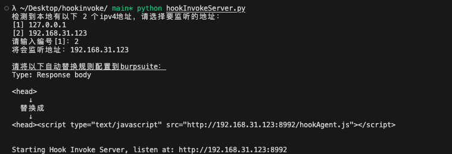
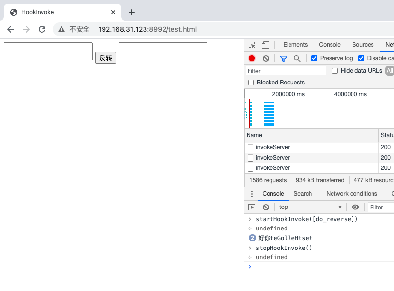
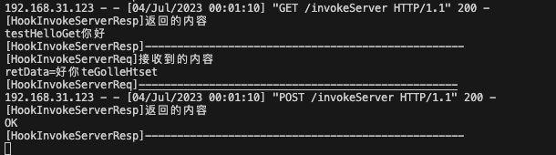
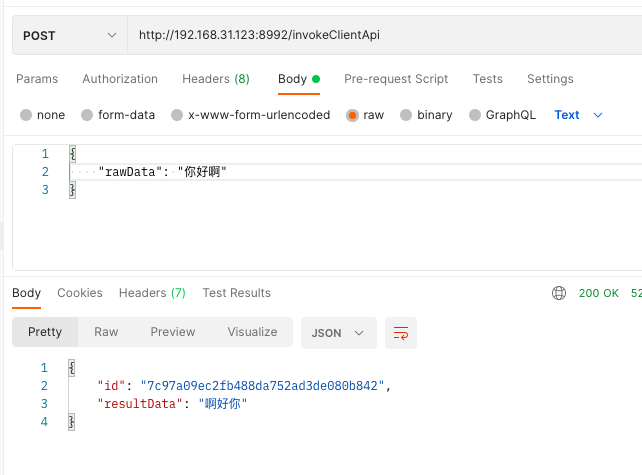
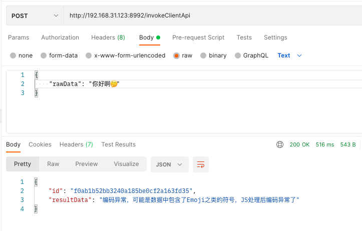
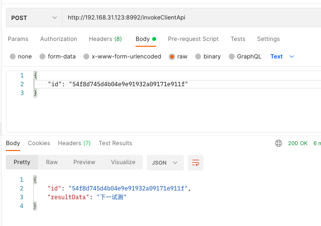

# JsHookInvoke
  
### 示例

启动server  

```
python hookInvokServer.py
```



在控制台使用 `startHookInvoke([func1, func2, ...])` 启动Agent，传入的函数数组要按对数据处理的顺序排序  



server看到 从server拉取待处理的数据 和 将处理后的数据推回server 效果



#### 20230705更新
完善了`数据存储`和`调用接口`

**Demo**

新增待处理的原数据：
```
Request：
POST /invokeClientApi HTTP/1.1
{
    "rawData": "测试一下"
}

Response：
{
    "id": "54f8d745d4b04e9e91932a09171e911f",
    "resultData": "下一试测"
}
```

查询结果数据：
```
Request：
POST /invokeClientApi HTTP/1.1
{
    "id": "54f8d745d4b04e9e91932a09171e911f"
}

Response：
{
    "id": "54f8d745d4b04e9e91932a09171e911f",
    "resultData": "下一试测"
}
```




